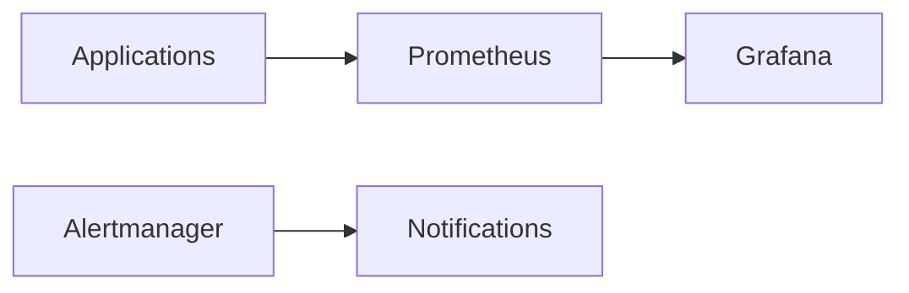

# Guide Complet d'Implémentation et Installation : Stack de Monitoring Kubernetes
> Helm, Prometheus, Grafana sur Windows

## Table des matières

1. [Introduction](#introduction)
2. [Architecture globale](#architecture-globale)
3. [Prérequis détaillés](#prérequis-détaillés)
4. [Installation pas à pas](#installation-pas-à-pas)
5. [Configuration avancée](#configuration-avancée)
6. [Sécurisation](#sécurisation)
7. [Maintenance](#maintenance)
8. [Troubleshooting](#troubleshooting)

## Introduction

### Objectif de ce guide
Ce guide détaille l'implémentation complète d'une stack de monitoring Kubernetes, incluant :
- Installation de l'environnement
- Configuration des outils
- Sécurisation de la stack
- Maintenance et dépannage

### Composants de la stack
1. **Kubernetes** : Plateforme d'orchestration de conteneurs
2. **Helm** : Gestionnaire de paquets pour Kubernetes
3. **Prometheus** : Système de collecte et stockage de métriques
4. **Grafana** : Interface de visualisation et tableaux de bord

## Architecture globale

### Flux de données


### Composants principaux
- **Prometheus Server** : Collecte et stocke les métriques
- **Alertmanager** : Gère les alertes
- **Grafana** : Visualisation des données
- **Exporters** : Collecteurs de métriques spécifiques

## Prérequis détaillés

### Configuration matérielle minimale
- CPU : 4 cœurs
- RAM : 16 GB
- Stockage : 50 GB SSD

### Logiciels requis
1. **Windows 10/11 Pro ou Enterprise**
   - Activation de Hyper-V nécessaire
   ```powershell
   Enable-WindowsOptionalFeature -Online -FeatureName Microsoft-Hyper-V -All
   ```

2. **Docker Desktop**
   - Version minimale : 4.x
   - Configuration recommandée :
   ```json
   {
     "cpus": 4,
     "memory": "8GB",
     "swap": "1GB"
   }
   ```

3. **Kubernetes**
   - Version minimale : 1.23
   - Activation via Docker Desktop

4. **Chocolatey**
   ```powershell
   Set-ExecutionPolicy Bypass -Scope Process -Force
   [System.Net.ServicePointManager]::SecurityProtocol = [System.Net.ServicePointManager]::SecurityProtocol -bor 3072
   iex ((New-Object System.Net.WebClient).DownloadString('https://chocolatey.org/install.ps1'))
   ```

5. **kubectl**
   - C'est l'outil de ligne de commande pour Kubernetes
   - Installation via PowerShell (administrateur) :
```powershell
# Télécharger kubectl
curl.exe -LO "https://dl.k8s.io/release/v1.28.0/bin/windows/amd64/kubectl.exe"

# Créer le dossier pour kubectl (si n'existe pas)
New-Item -Path "$env:USERPROFILE\.kube" -Type Directory -Force

# Déplacer kubectl.exe vers un dossier dans le PATH
Move-Item .\kubectl.exe -Destination "C:\Windows\System32\kubectl.exe" -Force

# Vérifier l'installation
kubectl version --client

# Alternative : Créer un dossier personnalisé et l'ajouter au PATH
New-Item -Path "C:\kubectl" -Type Directory -Force
Move-Item .\kubectl.exe -Destination "C:\kubectl\kubectl.exe" -Force
[Environment]::SetEnvironmentVariable("Path", $env:Path + ";C:\kubectl", [System.EnvironmentVariableTarget]::Machine)
```

## Installation pas à pas

### 1. Préparation de l'environnement

1.1 Vérification des prérequis
```powershell
# Vérifier Docker
docker version

# Vérifier Kubernetes
kubectl version

# Vérifier l'état du cluster
kubectl cluster-info
```

1.2 Configuration du réseau
```powershell
# Vérifier la connectivité
kubectl get nodes
```

### 2. Installation de Helm

2.1 Installation via Chocolatey
```powershell
choco install kubernetes-helm
```

2.2 Configuration initiale
```powershell
# Ajouter les dépôts
helm repo add stable https://charts.helm.sh/stable
helm repo add prometheus-community https://prometheus-community.github.io/helm-charts
helm repo add grafana https://grafana.github.io/helm-charts
helm repo update
```

### 3. Déploiement de Prometheus

3.1 Création du namespace
```powershell
kubectl create namespace monitoring
```

3.2 Configuration de Prometheus
```yaml
# prometheus-values.yaml
prometheus:
  prometheusSpec:
    retention: 15d
    resources:
      requests:
        memory: 2Gi
        cpu: 500m
      limits:
        memory: 4Gi
        cpu: 1000m
  alertmanager:
    enabled: true
    persistentVolume:
      enabled: true
      size: 10Gi
```

3.3 Installation
```powershell
helm install prometheus prometheus-community/prometheus `
  --namespace monitoring `
  -f prometheus-values.yaml
```

### 4. Déploiement de Grafana

4.1 Configuration de Grafana
```yaml
# grafana-values.yaml
grafana:
  persistence:
    enabled: true
    size: 10Gi
  adminPassword: "MonMotDePasseSecurise123!"
  datasources:
    datasources.yaml:
      apiVersion: 1
      datasources:
      - name: Prometheus
        type: prometheus
        url: http://prometheus-server.monitoring.svc.cluster.local
        access: proxy
        isDefault: true
```

4.2 Installation
```powershell
helm install grafana grafana/grafana `
  --namespace monitoring `
  -f grafana-values.yaml
```

## Configuration avancée

### 1. Configuration des alertes Prometheus

```yaml
# alertrules.yaml
groups:
- name: node
  rules:
  - alert: HighCPUUsage
    expr: 100 - (avg by(instance) (rate(node_cpu_seconds_total{mode="idle"}[2m])) * 100) > 80
    for: 5m
    labels:
      severity: warning
    annotations:
      description: "CPU utilisation élevée"
```

### 2. Configuration des dashboards Grafana

2.1 Import des dashboards essentiels
- Node Exporter Full (ID: 1860)
- Kubernetes Cluster (ID: 7249)
- Prometheus 2.0 (ID: 3662)

2.2 Configuration des variables
```json
{
  "templating": {
    "list": [
      {
        "name": "namespace",
        "type": "query",
        "datasource": "Prometheus",
        "query": "label_values(kube_namespace_status_phase, namespace)"
      }
    ]
  }
}
```

## Sécurisation

### 1. Configuration RBAC

```yaml
# rbac.yaml
apiVersion: rbac.authorization.k8s.io/v1
kind: ClusterRole
metadata:
  name: prometheus
rules:
- apiGroups: [""]
  resources:
  - nodes
  - nodes/proxy
  - services
  - endpoints
  - pods
  verbs: ["get", "list", "watch"]
```

### 2. Network Policies

```yaml
# network-policy.yaml
apiVersion: networking.k8s.io/v1
kind: NetworkPolicy
metadata:
  name: monitoring-network-policy
  namespace: monitoring
spec:
  podSelector: {}
  policyTypes:
  - Ingress
  - Egress
  ingress:
  - from:
    - namespaceSelector:
        matchLabels:
          name: kube-system
```

## Maintenance

### 1. Sauvegardes

```bash
#!/bin/bash
# backup-monitoring.sh
BACKUP_DIR="/backups/monitoring"
DATE=$(date +%Y%m%d)

# Sauvegarde des configurations
kubectl get -n monitoring configmap,secret -o yaml > "$BACKUP_DIR/configs_$DATE.yaml"

# Sauvegarde Prometheus
kubectl exec -n monitoring prometheus-0 -- tar czf /tmp/prometheus-data.tar.gz /prometheus

# Sauvegarde Grafana
curl -X GET "http://grafana:3000/api/dashboards" \
  -H "Authorization: Bearer $GRAFANA_API_KEY" \
  > "$BACKUP_DIR/dashboards_$DATE.json"
```

### 2. Mises à jour

```powershell
# Mise à jour Prometheus
helm upgrade prometheus prometheus-community/prometheus `
  --namespace monitoring `
  -f prometheus-values.yaml

# Mise à jour Grafana
helm upgrade grafana grafana/grafana `
  --namespace monitoring `
  -f grafana-values.yaml
```

## Troubleshooting

### 1. Commandes de diagnostic

```powershell
# Vérifier les pods
kubectl get pods -n monitoring

# Logs Prometheus
kubectl logs -f -n monitoring deployment/prometheus-server

# Logs Grafana
kubectl logs -f -n monitoring deployment/grafana

# État des PersistentVolumes
kubectl get pv,pvc -n monitoring
```

### 2. Problèmes courants

1. **Prometheus ne démarre pas**
   - Vérifier les ressources disponibles
   - Vérifier les permissions RBAC
   ```powershell
   kubectl describe pod -n monitoring prometheus-server-xyz
   ```

2. **Grafana ne se connecte pas à Prometheus**
   - Vérifier l'URL du datasource
   - Vérifier la résolution DNS
   ```powershell
   kubectl exec -it -n monitoring grafana-xyz -- nslookup prometheus-server
   ```

3. **Alertmanager ne fonctionne pas**
   - Vérifier la configuration
   - Vérifier la connectivité
   ```powershell
   kubectl port-forward -n monitoring svc/alertmanager 9093:9093
   ```

## Ressources additionnelles

- [Documentation officielle Kubernetes](https://kubernetes.io/docs/)
- [Documentation Prometheus](https://prometheus.io/docs/)
- [Documentation Grafana](https://grafana.com/docs/)
- [Helm Hub](https://artifacthub.io/)

## Support et communauté

- [Forum Kubernetes](https://discuss.kubernetes.io/)
- [Slack Kubernetes](https://kubernetes.slack.com/)
- [GitHub Prometheus](https://github.com/prometheus/prometheus)
- [GitHub Grafana](https://github.com/grafana/grafana)

---
© 2024 Niaina Nomenjanahary / Niainar's Dev
