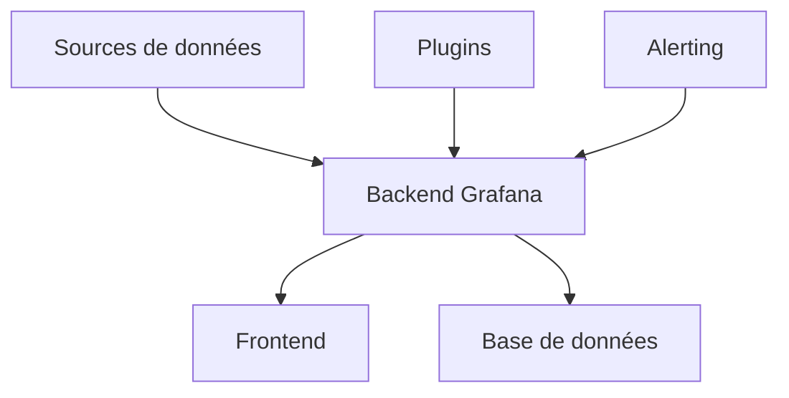

# Théorie et Fonctionnement de Grafana
> Plateforme de visualisation et d'analyse de données

## 1. Introduction à Grafana

### 1.1 Qu'est-ce que Grafana ?
Grafana est une plateforme open-source qui permet de :
- Visualiser des données complexes
- Créer des tableaux de bord dynamiques
- Analyser des métriques en temps réel
- Configurer des alertes sophistiquées

### 1.2 Caractéristiques principales
- Interface utilisateur intuitive
- Support multi-sources de données
- Système de plugins extensible
- Gestion avancée des permissions
- Partage et export de dashboards

## 2. Architecture

### 2.1 Composants principaux


1. **Frontend**
   - Interface utilisateur web
   - Rendu des graphiques
   - Éditeur de requêtes

2. **Backend**
   - Gestion des sessions
   - Cache des requêtes
   - Traitement des données
   - API REST

3. **Base de données**
   - Stockage des configurations
   - Gestion des utilisateurs
   - Sauvegarde des dashboards

## 3. Sources de Données

### 3.1 Types supportés
1. **Métriques**
   - Prometheus
   - InfluxDB
   - Graphite
   - CloudWatch

2. **Logs**
   - Loki
   - Elasticsearch
   - Splunk

3. **Traces**
   - Jaeger
   - Zipkin
   - Tempo

### 3.2 Configuration
```yaml
datasources:
  - name: Prometheus
    type: prometheus
    access: proxy
    url: http://prometheus:9090
    isDefault: true
    jsonData:
      timeInterval: "15s"
```

## 4. Visualisations

### 4.1 Types de panneaux
1. **Graphiques**
   - Time series
   - Gauge
   - Stat
   - Heatmap
   - Bar chart

2. **Tables**
   - Standard
   - Dynamic
   - Transformations

3. **Spécialisés**
   - Géomap
   - Node Graph
   - Status History

### 4.2 Configuration des panneaux
```json
{
  "panels": [
    {
      "type": "graph",
      "title": "CPU Usage",
      "datasource": "Prometheus",
      "targets": [
        {
          "expr": "rate(node_cpu_seconds_total{mode='user'}[5m])",
          "legendFormat": "{{instance}}"
        }
      ]
    }
  ]
}
```

## 5. Dashboards

### 5.1 Structure
```yaml
dashboard:
  title: "Production Overview"
  tags: ["production", "monitoring"]
  timezone: "browser"
  panels:
    - title: "System Load"
      type: "graph"
    - title: "Memory Usage"
      type: "gauge"
  templating:
    list:
      - name: "cluster"
        type: "query"
```

### 5.2 Variables
1. **Types**
   - Query
   - Custom
   - Interval
   - Datasource
   - Text

2. **Utilisation**
```sql
rate(http_requests_total{instance=~"$instance"}[5m])
```

## 6. Alerting

### 6.1 Configuration des alertes
```yaml
alerts:
  - name: "High CPU Usage"
    conditions:
      - type: "query"
        query:
          params: ['A', '5m', 'now']
          datasourceId: 1
    frequency: "1m"
    handler: 1
```

### 6.2 Canaux de notification
```yaml
notifiers:
  - name: "Team Slack"
    type: "slack"
    settings:
      url: "https://hooks.slack.com/services/xxx"
      recipient: "#alerts"
```

## 7. Administration

### 7.1 Gestion des utilisateurs
- Rôles prédéfinis
- RBAC personnalisé
- Intégration LDAP/OAuth

### 7.2 Configuration organisationnelle
```yaml
auth:
  ldap:
    enabled: true
    config_file: /etc/grafana/ldap.toml
  oauth:
    github:
      enabled: true
      client_id: "your_client_id"
```

## 8. Provisioning

### 8.1 Dashboards automatisés
```yaml
apiVersion: 1
providers:
  - name: 'default'
    folder: ''
    type: file
    options:
      path: /var/lib/grafana/dashboards
```

### 8.2 Configuration as Code
```yaml
dashboards:
  - name: "Kubernetes Cluster"
    json: |
      {
        "title": "Kubernetes Overview",
        "panels": []
      }
```

## 9. Performance

### 9.1 Optimisation
- Caching des requêtes
- Intervalles de rafraîchissement
- Agrégation des données

### 9.2 Configuration recommandée
```ini
[server]
read_timeout = 30
write_timeout = 30

[database]
max_open_conn = 300

[security]
disable_gravatar = true
```

## 10. Intégration

### 10.1 API REST
```bash
# Exemple de requête API
curl -H "Authorization: Bearer $API_KEY" \
     http://grafana:3000/api/dashboards/uid/xyz
```

### 10.2 Plugins personnalisés
```typescript
export class CustomPanel extends PanelPlugin {
  constructor() {
    super();
    this.setPanelOptions(builder => {
      builder.addTextInput({
        path: "text",
        name: "Simple text option",
        description: "Description of panel option",
        defaultValue: "Default value of text input option",
      });
    });
  }
}
```

## 11. Sécurité

### 11.1 Authentification
- Basic Auth
- LDAP
- OAuth
- Proxy Auth

### 11.2 Autorisation
```yaml
roles:
  - name: "CustomEditor"
    permissions:
      - action: "dashboards:create"
      - action: "dashboards:write"
        scope: "folders:*"
```

## 12. Bonnes Pratiques

### 12.1 Organisation des dashboards
- Structure cohérente
- Nommage standardisé
- Tags pertinents
- Documentation intégrée

### 12.2 Visualisation
- Échelles appropriées
- Légendes claires
- Seuils visuels
- Annotations contextuelles

## 13. Troubleshooting

### 13.1 Logs
```bash
# Vérification des logs
tail -f /var/log/grafana/grafana.log

# Debug mode
grafana-server --config=/etc/grafana/grafana.ini --debug
```

### 13.2 Problèmes courants
1. Problèmes de connexion aux sources
2. Performances des requêtes
3. Erreurs de rendu
4. Problèmes d'authentification

---
© 2024 Niaina Nomenjanahary / Niainar's Dev
