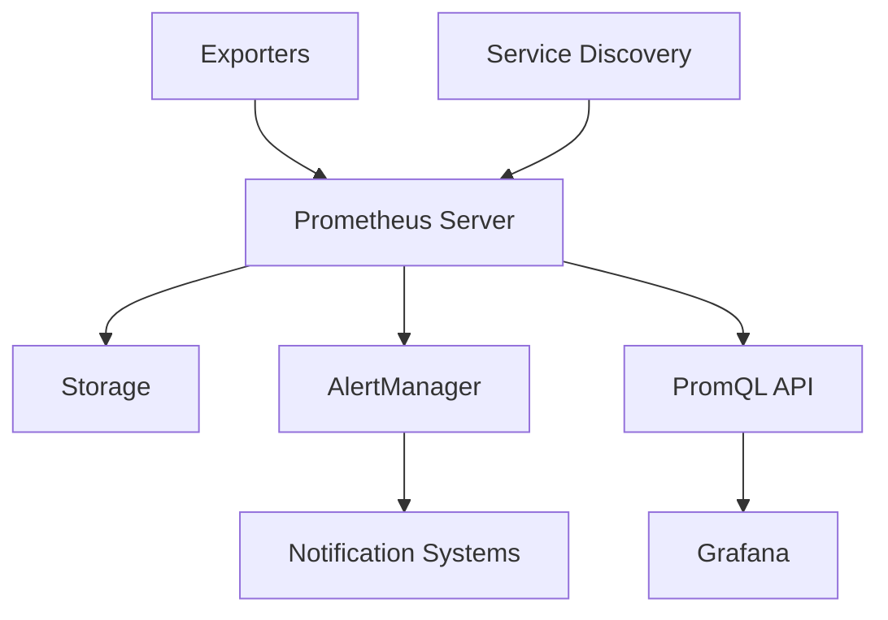

# Théorie et Fonctionnement de Prometheus
> Système de monitoring et d'alerte pour les environnements cloud-native

## 1. Introduction à Prometheus

### 1.1 Qu'est-ce que Prometheus ?
Prometheus est un système open-source de monitoring et d'alerte qui :
- Collecte des métriques en temps réel
- Stocke les données de manière efficace
- Permet des requêtes complexes
- Génère des alertes basées sur des conditions

### 1.2 Caractéristiques principales
- Modèle de données multidimensionnel
- Langage de requête flexible (PromQL)
- Architecture autonome sans dépendances
- Collection de données via HTTP pull
- Push supporté via gateway intermédiaire
- Découverte de services dynamique

## 2. Architecture

### 2.1 Composants principaux


1. **Prometheus Server**
   - Collecteur de métriques
   - Base de données temporelle (TSDB)
   - Moteur de requêtes
   - HTTP server

2. **Exporters**
   - node_exporter (métriques système)
   - mysql_exporter
   - blackbox_exporter
   - custom exporters

3. **AlertManager**
   - Gestion des alertes
   - Déduplication
   - Groupement
   - Routage

4. **Service Discovery**
   - Kubernetes
   - Consul
   - File-based
   - DNS

## 3. Modèle de Données

### 3.1 Format des métriques
```plaintext
<metric_name>{<label_name>=<label_value>, ...} value timestamp
```

Exemple :
```plaintext
http_requests_total{status="200", method="GET"} 1234 1697483322
```

### 3.2 Types de métriques

1. **Counter**
   - Valeur qui ne peut qu'augmenter
   - Exemple : nombre total de requêtes
```prometheus
# TYPE http_requests_total counter
http_requests_total{method="post",code="200"} 1027
```

2. **Gauge**
   - Valeur qui peut monter ou descendre
   - Exemple : utilisation mémoire
```prometheus
# TYPE memory_usage_bytes gauge
memory_usage_bytes{instance="server01"} 4.12e9
```

3. **Histogram**
   - Distribution des observations
   - Exemple : latence des requêtes
```prometheus
# TYPE http_request_duration_seconds histogram
http_request_duration_seconds_bucket{le="0.1"} 32
```

4. **Summary**
   - Similar à l'histogram mais avec des quantiles
```prometheus
# TYPE request_duration_seconds summary
request_duration_seconds{quantile="0.95"} 0.123
```

## 4. PromQL (Prometheus Query Language)

### 4.1 Concepts de base
```promql
# Sélection simple
http_requests_total

# Avec filtre de labels
http_requests_total{status="200"}

# Opérateurs mathématiques
rate(http_requests_total[5m])

# Agrégation
sum(rate(http_requests_total[5m])) by (status)
```

### 4.2 Fonctions importantes
```promql
# Taux de variation
rate() - pour counters
irate() - pour variations instantanées

# Agrégation
sum(), avg(), max(), min()

# Opérations sur le temps
increase(metric[1h])
```

## 5. Configuration

### 5.1 Fichier de configuration principal
```yaml
global:
  scrape_interval: 15s
  evaluation_interval: 15s

scrape_configs:
  - job_name: 'prometheus'
    static_configs:
      - targets: ['localhost:9090']

  - job_name: 'node'
    kubernetes_sd_configs:
      - role: node
```

### 5.2 Configuration des règles
```yaml
groups:
- name: example
  rules:
  - record: job:http_requests_total:rate5m
    expr: sum(rate(http_requests_total[5m])) by (job)
```

## 6. Stockage

### 6.1 TSDB (Time Series Database)
- Format de stockage optimisé
- Compression efficace
- Rétention configurable
- Structure des blocs :
```plaintext
data/
├── 01BKGV7JBM69T2G1BGBGM6KB12
│   └── meta.json
├── 01BKGTZQ1SYQJTR4PB43C8PD98
│   ├── chunks
��   │   └── 000001
│   ├── index
│   └── meta.json
└── wal
    ├── 000000002
    └── checkpoint.000001
```

### 6.2 Rétention et Performance
```yaml
storage:
  tsdb:
    retention.time: 15d
    retention.size: 50GB
    wal:
      retention.time: 5d
```

## 7. Service Discovery

### 7.1 Kubernetes SD
```yaml
scrape_configs:
  - job_name: 'kubernetes-pods'
    kubernetes_sd_configs:
      - role: pod
    relabel_configs:
      - source_labels: [__meta_kubernetes_pod_annotation_prometheus_io_scrape]
        action: keep
        regex: true
```

### 7.2 File-based SD
```yaml
scrape_configs:
  - job_name: 'file_sd'
    file_sd_configs:
      - files:
        - 'targets/*.json'
```

## 8. Alerting

### 8.1 Règles d'alerte
```yaml
groups:
- name: example
  rules:
  - alert: HighRequestLatency
    expr: job:request_latency_seconds:mean5m{job="myjob"} > 0.5
    for: 10m
    labels:
      severity: page
    annotations:
      summary: High request latency on {{ $labels.instance }}
```

### 8.2 Configuration Alertmanager
```yaml
route:
  group_by: ['alertname']
  group_wait: 30s
  group_interval: 5m
  repeat_interval: 1h
  receiver: 'team-emails'
receivers:
- name: 'team-emails'
  email_configs:
  - to: 'team@example.org'
```

## 9. Best Practices

### 9.1 Instrumentation
- Nommage cohérent des métriques
- Labels pertinents
- Documentation des métriques
- Granularité appropriée

### 9.2 Performance
- Optimisation des intervalles de scraping
- Gestion de la rétention
- Dimensionnement des ressources
- Monitoring du monitoring

## 10. Intégration

### 10.1 Exporters communs
- node_exporter
- blackbox_exporter
- mysql_exporter
- postgresql_exporter

### 10.2 API clients
```python
from prometheus_client import Counter
c = Counter('my_failures', 'Description of counter')
c.inc()     # Increment by 1
c.inc(1.6)  # Increment by given value
```

## 11. Troubleshooting

### 11.1 Commandes utiles
```bash
# Vérifier la configuration
promtool check config prometheus.yml

# Tester les règles
promtool test rules rules.yml

# Debug des targets
curl localhost:9090/targets
```

### 11.2 Problèmes courants
1. Problèmes de scraping
2. Surcharge mémoire
3. Perte de données
4. Latence des requêtes

---
© 2024 Niaina Nomenjanahary / Niainar's Dev
