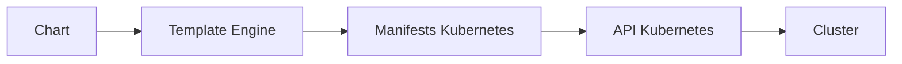

# Théorie et Fonctionnement de Helm
> Le gestionnaire de paquets pour Kubernetes

## 1. Introduction à Helm

### 1.1 Qu'est-ce que Helm ?
Helm est le gestionnaire de paquets officiel de Kubernetes. Il permet de :
- Empaqueter des applications Kubernetes
- Distribuer ces paquets (appelés "charts")
- Gérer le cycle de vie des applications déployées

### 1.2 Analogies
- Si Kubernetes est un système d'exploitation, Helm est son "App Store"
- Si Kubernetes est Ubuntu, Helm est APT
- Si Kubernetes est la machine, Helm est l'installateur

## 2. Concepts Fondamentaux

### 2.1 Charts
Un Chart Helm est un ensemble de fichiers qui décrivent un groupe de ressources Kubernetes. Il contient :
```plaintext
mychart/
  ├── Chart.yaml           # Métadonnées du chart
  ├── values.yaml          # Valeurs par défaut
  ├── charts/              # Charts dépendants
  └── templates/           # Templates Kubernetes
      ├── deployment.yaml
      ├── service.yaml
      └── _helpers.tpl
```

### 2.2 Releases
Une Release est une instance d'un Chart déployée dans un cluster Kubernetes.
- Chaque installation crée une nouvelle release
- Les releases sont versionnées
- Permet le rollback vers des versions précédentes

### 2.3 Repositories
Les repositories sont des dépôts qui stockent et partagent les charts :
- Repositories publics (ex: artifacthub.io)
- Repositories privés d'entreprise
- Repositories locaux

## 3. Architecture de Helm

### 3.1 Composants Principaux
1. **Client Helm (CLI)**
   - Interface en ligne de commande
   - Gère les charts locaux
   - Interagit avec les repositories
   - Envoie les charts au serveur Kubernetes

2. **Bibliothèques Helm**
   - Logique de templating
   - Gestion des packages
   - Communication avec Kubernetes

### 3.2 Flux de Travail


## 4. Fonctionnalités Clés

### 4.1 Templating
- Utilise le moteur de template Go
- Permet la réutilisation de configurations
- Supporte les fonctions et pipelines
```yaml
apiVersion: v1
kind: Service
metadata:
  name: {{ .Release.Name }}-{{ .Values.service.name }}
spec:
  ports:
    - port: {{ .Values.service.port }}
```

### 4.2 Gestion des Valeurs
1. **Hiérarchie des valeurs**
   - values.yaml par défaut
   - Fichiers de valeurs personnalisés
   - Arguments en ligne de commande

2. **Exemple de values.yaml**
```yaml
service:
  name: frontend
  port: 80
  type: ClusterIP

image:
  repository: nginx
  tag: latest
  pullPolicy: IfNotPresent
```

### 4.3 Hooks
Les hooks permettent d'exécuter des actions à des moments spécifiques :
- pre-install
- post-install
- pre-upgrade
- post-upgrade
- pre-delete
- post-delete

## 5. Bonnes Pratiques

### 5.1 Structure des Charts
```plaintext
chart/
  ├── .helmignore
  ├── Chart.yaml
  ├── values.yaml
  ├── values.schema.json
  ├── charts/
  ├── templates/
  │   ├── NOTES.txt
  │   ├── _helpers.tpl
  │   ├── deployment.yaml
  │   ├── service.yaml
  │   └── tests/
  └── README.md
```

### 5.2 Versionnement
- Utiliser le versionnement sémantique
- Documenter les changements
- Maintenir un CHANGELOG

### 5.3 Sécurité
- Valider les charts avant déploiement
- Utiliser des repositories sécurisés
- Implémenter le contrôle d'accès RBAC

## 6. Cas d'Utilisation Avancés

### 6.1 Dépendances
```yaml
# Chart.yaml
dependencies:
  - name: mongodb
    version: 8.0.0
    repository: https://charts.bitnami.com/bitnami
```

### 6.2 Tests
```yaml
# templates/tests/test-connection.yaml
apiVersion: v1
kind: Pod
metadata:
  name: "{{ .Release.Name }}-test"
  annotations:
    "helm.sh/hook": test
spec:
  containers:
    - name: test
      image: busybox
      command: ['wget']
      args: ['{{ .Release.Name }}:{{ .Values.service.port }}']
```

### 6.3 Subchart et Library Charts
- Réutilisation de composants communs
- Modularisation des applications
- Partage de fonctionnalités

## 7. Cycle de Vie d'un Chart

### 7.1 Développement
1. Création de la structure
2. Développement des templates
3. Tests locaux
4. Documentation

### 7.2 Distribution
1. Empaquetage
2. Publication dans un repository
3. Mise à jour des index
4. Gestion des versions

### 7.3 Maintenance
1. Mises à jour
2. Corrections de bugs
3. Gestion des dépendances
4. Support des utilisateurs

## 8. Intégration Continue

### 8.1 Pipeline CI/CD
```yaml
stages:
  - lint
  - test
  - package
  - publish

helm-lint:
  stage: lint
  script:
    - helm lint ./chart

helm-test:
  stage: test
  script:
    - helm template ./chart
    - helm test ./chart

helm-package:
  stage: package
  script:
    - helm package ./chart

helm-publish:
  stage: publish
  script:
    - helm push ./chart-*.tgz repository
```

## 9. Troubleshooting

### 9.1 Commandes de Diagnostic
```bash
# Vérifier la syntaxe
helm lint ./chart

# Voir les templates générés
helm template ./chart

# Vérifier l'état d'une release
helm status release-name

# Voir l'historique
helm history release-name
```

### 9.2 Problèmes Courants
1. Erreurs de template
2. Conflits de dépendances
3. Problèmes de permissions
4. Incompatibilités de versions

---
© 2024 Niaina Nomenjanahary / Niainar's Dev
